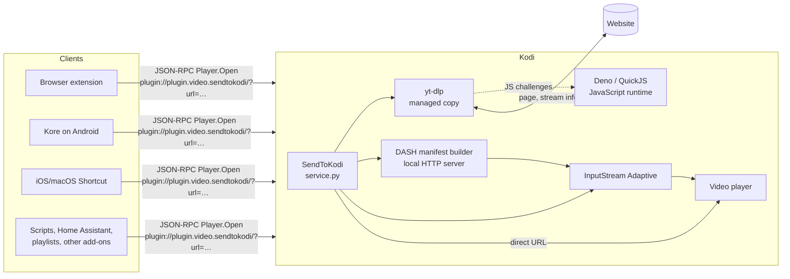

# How it works

SendToKodi is a thin add-on around [yt-dlp](https://github.com/yt-dlp/yt-dlp). Its job is to get a URL from a client
into yt-dlp, keep yt-dlp and its JavaScript runtime current, and turn yt-dlp's result into something Kodi's player can
play well, which for adaptive streams means building a DASH manifest. This page follows that path.

## Overview

Every playback runs through `service.py`, the plugin entry point Kodi starts with the plugin URL. The `core` package
holds the logic, split into modules that are tested without Kodi (see [Development](development.md#project-structure)).

## The resolve-and-play flow

1. **Parse the request.** `core.addon_params` reads the plugin URL: the `url=` form, the legacy raw form, the
   `yt-dlp-options` JSON and the `action=queue` request. Queue requests are handled right away: the item is appended
   to Kodi's video playlist with the plugin URL as its path and the add-on exits.
2. **Make sure yt-dlp is there.** `core.runtime.actions.configure_managed_ytdlp` puts the installed managed yt-dlp
   on `sys.path` without any network access (or checks the system package for the `System` channel) and downloads it
   only when none is installed. The check for a new release runs at the end, see step 7. The
   [managed runtimes](#managed-runtimes) section has the details.
3. **Build the yt-dlp options.** Defaults (`extract_flat` for playlists), then the options from the
   [config file](settings.md#using-a-yt-dlp-config-file), then the per-request options, then the JavaScript runtime
   options. The config file is parsed with yt-dlp's own option parser and only the options the file changes are taken
   over, so yt-dlp's command line defaults don't override the add-on's defaults.
4. **Resolve.** `YoutubeDL.extract_info` fetches the page and returns the stream information. A Kodi progress dialog
   is shown meanwhile. With auto-download on, yt-dlp downloads the file now and the local path is used.
5. **Playlist or single item.** A result with `entries` is a playlist: each entry becomes a playlist item whose path
   is again a SendToKodi plugin URL, so it resolves when played. A single item goes through stream selection.
6. **Select the stream** and build the `ListItem` for Kodi: path, InputStream Adaptive properties, HTTP headers,
   title, description, thumbnail and subtitles. `xbmcplugin.setResolvedUrl` hands it to the player.
7. **Check for runtime updates.** With auto-update on, `update_runtimes_after_playback` checks for new yt-dlp and
   Deno releases while Kodi already plays, and installs them for the next playback.

## Managed runtimes

yt-dlp changes weekly, because websites do, and Kodi's add-on repositories are too slow for that. So the add-on keeps
its own copy of yt-dlp, and of the Deno JavaScript runtime yt-dlp needs for YouTube, under its data folder, and
updates them itself. `core.managed_runtime` is the shared logic, `core.ytdlp_manager` and `core.deno_manager` the two
runtimes.

- **Where.** `special://profile/addon_data/plugin.video.sendtokodi/ytdlp/versions/<version>/` holds the extracted
  `yt_dlp` package of each installed version, `deno/versions/<version>/` the Deno binary. A version file next to them
  (`ytdlp_version.txt`, `deno_version.txt`) names the active version. Up to three versions are kept per runtime, so going back after a bad release is one click
  in *Manage … version*.
- **Sources.** Stable yt-dlp comes from the tag archives of
  [yt-dlp/yt-dlp](https://github.com/yt-dlp/yt-dlp/releases), nightly from the release assets of
  [yt-dlp/yt-dlp-nightly-builds](https://github.com/yt-dlp/yt-dlp-nightly-builds/releases). Deno comes from the
  [denoland/deno](https://github.com/denoland/deno/releases) releases, with builds for Linux and macOS on x86_64 and
  ARM64 and for Windows on x86_64. Archives are extracted with path checks, so a crafted archive cannot write outside
  the version folder.
- **Update timing.** An installed yt-dlp or Deno is used right away. The update check runs after the stream has been
  handed to Kodi (also after a failed resolve, since an outdated yt-dlp is the usual cause), so it never delays
  playback; a newer release is used from the next playback on.
- **Update cadence.** With auto-update on, the add-on asks GitHub for the latest release at most every six hours;
  when GitHub answers *not modified*, the next check waits four times as long. Failures back off in steps from five
  minutes to a day, so a device without internet does not hammer GitHub or delay playback. The state lives in a small
  JSON file per runtime and source.
- **No auto-update.** Then a missing yt-dlp triggers a yes/no dialog once a day; a declined dialog is remembered for
  24 hours. Updates are only installed through *Update … now* or *Manage … version*.
- **System channel.** `System` skips downloads and uses whatever `import yt_dlp` finds in Kodi's Python, for
  platforms that package yt-dlp themselves.

### The JavaScript runtime

Since 2025 YouTube requires solving JavaScript challenges to get working stream URLs, and yt-dlp delegates that to an
external JavaScript runtime plus a script it fetches from GitHub (the `ejs` remote component). The add-on passes the
runtime to yt-dlp as `js_runtimes` together with `remote_components: {'ejs:github'}`.

`core.addon_params.resolve_js_runtime_opts` decides which runtime to use from the *JavaScript runtime mode* setting:

| Mode | Runtime |
|---|---|
| `auto` | QuickJS if the device is ARMv7 and a QuickJS path is set, otherwise Deno (downloaded if needed), otherwise QuickJS if a path is set |
| `deno` | Deno |
| `quickjs` | The QuickJS binary from *QuickJS binary path*, if it exists and is executable |
| `disabled` | None; sites with JavaScript challenges fail |

Deno has no ARMv7 and no Android build, which is why QuickJS exists as an option; see
[ARMv7 devices](troubleshooting.md#armv7-devices-raspberry-pi-2-and-3-32-bit) and
[Android](troubleshooting.md#android-android-tv-fire-tv).

## Stream selection

`core.playback_selection.select_playback_source` picks what Kodi plays from the formats yt-dlp reports. The result
carries a URL, whether InputStream Adaptive (ISA) should play it, the manifest type and the HTTP headers. In order of
preference:

1. **The stream the user chose** when *Ask which stream to play* is on. If that stream turns out not to be playable,
   automatic selection runs instead.
2. **A downloaded file** when auto-download is on and the file exists.
3. **The site's own manifest** (DASH `.mpd` or HLS `.m3u8`) when *Use original manifest* is on, ISA supports the type
   and the manifest respects the maximum resolution.
4. **A DASH manifest built by the add-on** from separate video and audio formats when the DASH builder is on and ISA
   can play DASH. This is how YouTube plays above 720p.
5. **A single progressive format** with video and audio in one file, the best one within the maximum resolution,
   played by Kodi's own player.

The maximum resolution caps the width of the chosen video format, or of the formats put into the built manifest.
*Adaptive (auto quality)* lifts the cap. Audio-only results (SoundCloud, podcasts) skip the video logic and create a
music item, so Kodi shows its audio visualisation instead of a black screen.

## The DASH manifest builder

YouTube and many other sites serve their good qualities as separate video and audio streams. Kodi's player cannot
combine two files, but InputStream Adaptive can, if it gets a DASH manifest that lists them. `core.dash_builder` writes
that manifest:

- For each selected format it fetches the first bytes of the file and locates the initialisation segment and the
  index (the `sidx` box in MP4, the Cues in WebM), because a DASH manifest with `SegmentBase` needs those byte ranges.
  The probes run in parallel and grow until the boxes are found.
- It writes an MPD with one adaptation set per kind: video, audio per language, with the codec, bandwidth, resolution
  and duration from yt-dlp. Descriptive audio tracks are marked so ISA does not pick them by default.
- A small HTTP server on localhost, started on demand, serves the manifest. ISA requests it, and the stream URLs in it
  point straight at the site; the add-on is not in the media path. The server shuts down after the idle timeout
  (*DASH MPD server idle timeout*, 120 seconds by default).
- Stream URLs expire, so when ISA requests the manifest again after the idle timeout (a resume after a pause, a seek
  after a long time), the add-on re-resolves the page with yt-dlp and regenerates the manifest with fresh URLs.

## Headers, subtitles and metadata

Many sites answer 403 unless the requests for the manifest and the media carry the same `User-Agent`, `Referer` and
cookies yt-dlp used. The add-on takes the headers yt-dlp reports for the format and the page and passes them to ISA as
`inputstream.adaptive.manifest_headers` and `stream_headers`, or appends them to the URL after `|` for Kodi's own
player, which is Kodi's convention for HTTP headers.

Subtitles yt-dlp lists are downloaded to `addon_data/plugin.video.sendtokodi/subtitles/` with safe file names, with a
20-second timeout per file, and attached to the list item, so they show up in Kodi's subtitle dialog. Title, description
and thumbnail come from the yt-dlp result and fill Kodi's player info.

## Files on disk

Everything the add-on writes lives in Kodi's profile folder, so it survives add-on updates and goes away with
*Uninstall → also delete settings and data*:

| Path under `special://profile/addon_data/plugin.video.sendtokodi/` | Contents |
|---|---|
| `settings.xml` | The settings |
| `ytdlp/versions/<version>/` | Installed yt-dlp versions (the `yt_dlp` package) |
| `ytdlp/ytdlp_version.txt`, `ytdlp/*.json` | Active yt-dlp version, update state per channel |
| `deno/versions/<version>/` | Installed Deno versions |
| `deno/deno_version.txt`, `deno/*.json` | Active Deno version, update state |
| `downloads/` | Media files from auto-download (configurable) |
| `subtitles/` | Downloaded subtitle files |
| `yt-dlp-config-copy.conf` | Local copy of a yt-dlp config file that lives on a network share |

`special://profile` is Kodi's user data folder, for example `~/.kodi/userdata` on Linux, `%APPDATA%\Kodi\userdata` on
Windows and `/storage/.kodi/userdata` on LibreELEC and CoreELEC.

## Why it is built this way

- **yt-dlp inside Kodi, not a server next to it.** Everything runs on the Kodi device, there is nothing else to
  install or keep running, and the clients stay trivial: they only send a URL.
- **Managed runtimes instead of bundled ones.** A bundled yt-dlp would be outdated within weeks. Managing it in
  `addon_data` lets the add-on update yt-dlp without an add-on release, keep several versions, and switch to nightly
  builds when a site breaks.
- **A manifest builder instead of a proxy.** Media bytes flow directly from the website to InputStream Adaptive. The
  add-on only serves a few kilobytes of XML, so there is no bottleneck and nothing to keep alive during playback.
- **Testable core.** The `core` modules take Kodi's functions as parameters or import the `xbmc` modules lazily, so
  the unit tests run on a normal Python without Kodi.
